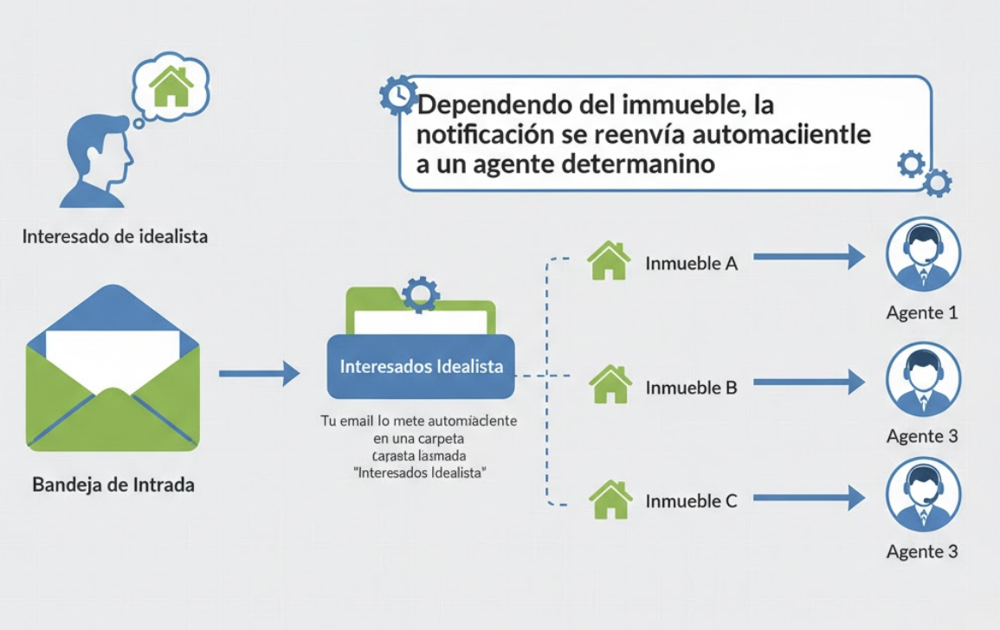

import EmailSignupCTA from '@/components/common/EmailSignupCTA';

## Introducción

En esta guía práctica aprenderás paso a paso **cómo recibir notificaciones de interesados en Idealista** y cómo configurar y gestionar esas alertas para no perder oportunidades.

Veremos desde la configuración de tu bandeja de entrada y la app de Idealista, hasta filtros y buenas prácticas para convertir cada contacto en un lead atendido a tiempo.

También os mostraremos algunas soluciones como [Estavia](/), que automatizan todo el proceso sin necesidad de configurar nada.

## Cómo funciona el sistema de notificaciones de Idealista

Entender el flujo de mensajes y alertas de Idealista es el primer paso para saber cómo recibir notificaciones de nuevos interesados de forma eficiente.

### Tipos de notificación de Idealista

Existen tres tipos de notificaciones que Idealista te puede mandar:

- Mensajes de interesados desde el **formulario del anuncio**: Estos suelen ser **nuevos interesados** en un inmueble.
- Mensajes desde el **chat de Idealista**: Un interesado puede mandar más mensajes a través de Idealista. Idealista te avisará de estos nuevos mensajes.
- Alertas de anuncios que tengamos publicados: Anuncios nuevos publicados, resúmenes de visitas a anuncios, etc.

### Formas en las que Idealista te avisa de nuevos interesados

Idealista centraliza el contacto de clientes interesados en cada anuncio y ofrece varias vías para avisarte:

- Alertas al **correo electrónico** de la agencia
- El Inbox/gestor de mensajes dentro de la propia **plataforma de Idealista**
- Notificaciones push en la **app móvil de Idealista**

---

## ¿Cómo activo las notificaciones de interesados en Idealista?

Por defecto, **Idealista te avisará automáticamente**, solo tienes que asegurarte de tener configurados los siguientes ajustes:

1. Si quieres recibir estas alertas por correo electrónico, asegúrate que el email de la cuenta de Idealista desde donde publicas tus inmuebles es la misma dirección de correo electrónico en la cual quieres recibir estas notificaciones. Esto lo puedes hacer desde ajustes de cuenta en el portal de Idealista.

2. Si quieres recibir estas alertas en tu movil, instala la App de Idealista y entra con tu cuenta de inmobiliaria.

3. Si quieres recibir estas alertas en un CRM o un software como [Estavia](/), asegúrate de tener configurada la recepción de interesados en ese software. [Pinchando aquí](#) te explicamos cómo configurar tu email para recibir todos los interesados de Idealista en tu panel de [Estavia](/).

Si quieres aprender en detalle como mirar estos ajustes, pincha [aquí](#)

## Como recibir notificaciones para que no se nos escape ningún interesado

Vamos al meollo del asunto.

Existen varias maneras de organizar la recepción de interesados de Idealista automáticamente:

### 1. Usar tu email (gratis)

Esta es una manera fácil de empezar a organizar mejor tus interesados, aunque requiere un poco de nivel técnico, cualquier persona puede hacerlo.

Se basa en crear una carpeta en la cuenta de email de tu inmobiliaria donde se van volcando todos los interesados que van llegando automáticamente. Esto se hacer con una regla de filtrado en tu cuenta de email.

Además, puedes ir más allá y redirigir cada interesado que llega, según el inmueble que sea, a un agente distinto de tu agencia inmobiliaria.

Si quieres saber cómo configurar esto paso a paso en tu cliente de email pincha en los siguientes enlaces:

1. [Automatizar recepción de interesados de Idealista en Gmail](#)
2. [Automatizar recepción de interesados de Idealista en Outlook](#)
3. [Automatizar recepción de interesados de Idealista en un Webmail genérico](#)

### 2. Usar un software específico como Estavia (recomendado)

[Estavia](/) es una **inteligencia artificial que automatiza el primer contacto con los interesados de Idealista** y los califica por tí, para que solo tengas que llamar a los leads que están verdaderamente interesados y listos para encontrar algo, ahorrándote horas de trabajo.

Podrás ver los interesados que van llegando en tiempo real, ver los que ya han sido atendidos por un agente y tener una auditoría en tiempo real de cada interesado para que no se os escape ni uno.

El equipo de [Estavia](/) puede ayudarte a configurar Idealista de tal manera de que todos los interesados [lleguen directamente a tu panel de Estavia](/#funcionalidades)

También existen otros CRM manuales que pueden incluir esta opción, como [Witei](https://faq.witei.com/es/articles/118118-idealista). Échales un ojo si quieres tener tu agencia más organizada.

### 3. Usar la propia aplicación de Idealista (no recomendado)

Puedes hacer que todos los agentes estén constantemente logeados en la aplicación de Idealista y contestar directamente a los interesados por ahí.

Ya sea en el movil o en el ordenador.

Esta forma de organizarse no la recomendamos pues la aplicación de Idealista es un poco confusa y algún interesado se os puede escapar al no haber un indicador de quién está contestando a quién.

## Conclusión

A la hora de organizar los interesados que van llegando de Idealista es super importante estar organizados.

## Preguntas Frecuentes (FAQs)

### ¿Qué hago si no estoy recibiendo notificaciones de interesados de Idealista?

Revisa primero el email de la cuenta con la que has publicado el anuncio, la carpeta de spam y los permisos de la app. Comprueba en Idealista que las notificaciones por email estén activadas y realiza una prueba (como si fueses un interesado en tu inmueble). Si usas reenvío a CRM o una plataforma como [Estavia](/), verifica las reglas de filtrado y mapeo; a menudo el problema está en un filtro o en permisos del buzón de tu correo electrónico.

### ¿Cómo activo las notificaciones push en la app para recibir notificaciones de interesados de Idealista?

Instala la app de Idealista, inicia sesión con la cuenta del anuncio y acepta permisos de notificación al instalarla. Si ya instalaste la app, habilítalas en Ajustes del móvil (iOS: Ajustes > Notificaciones > Idealista; Android: Ajustes > Aplicaciones > Idealista > Notificaciones) y dentro de la app verifica las preferencias de alertas.

### ¿Cuál es la mejor forma de priorizar los mensajes al recibir notificaciones de interesados de Idealista?

La forma más rápida y sencilla es implementando [Estavia](/) en tu agencia.

También puedes deficiner una serie de reglas simples de filtrado de interesados. Usa etiquetas automáticas y plantillas para respuestas inmediatas.

### ¿Puedo integrar las notificaciones de interesados de Idealista con mi CRM?

La respuesta corta es sí. Muchos CRMs especializados tienen una opción para volcar los interesados que van llegando a tu email al propio CRM.

También existen opciones algo más complicadas como conectores (Zapier/Make) o API/webhooks si están disponibles.

[Estavia](/) se encarga del primer contacto con el interesado por tí usando inteligencia artificial.

### ¿Qué requisitos legales debo cumplir al procesar Como recibir notificaciones de interesados de Idealista?

Asegura la base legal (consentimiento o interés legítimo), informa en tu política de privacidad sobre el tratamiento y periodo de retención, protege los datos con acceso restringido y cifrado, y ofrece mecanismos de rectificación/supresión. Consulta la AEPD (https://www.aepd.es) y verifica que proveedores como Estavia cumplan GDPR.
