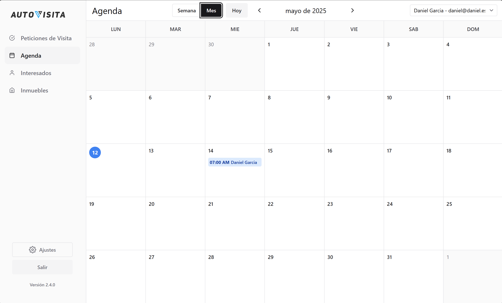
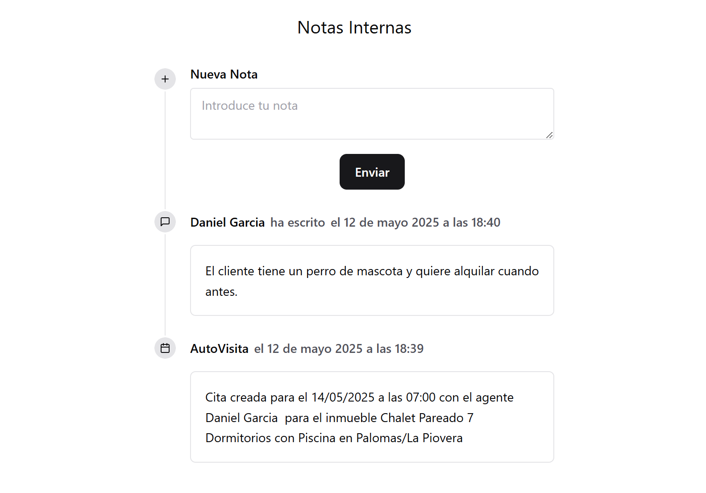

### WhatsApp, vista de calendario y auditoría de visitas!

#### WhatsApp

Autovisita ahora es capaz de enviar mensajes personalizados a tus interesados directamente desde el WhatsApp de la inmobiliaria.

Para activar esta funcionalidad solo tienes que enlazar tu cuenta de WhatsApp Business con AutoVisita en la página de ajustes de tu cuenta.

#### Vista de calendario

Hemos introducido una nueva vista de calendario para ver las visitas programadas. De manera más sencilla.

#### Auditoría de visitas

AutoVisita ahora registra todas las visitas programadas, así como todas las cancelaciones, como una nota interna en el interesado.

De esta manera es mucho más fácil ver cuándo se ha programado una visita a un interesado.

### Mejoras

- Se ha arreglado un problema que impedía crear un interesado directamente desde la agenda de visitas.
- Se han arreglado varios problemas que impedían el correcto funcionamiento de la aplicación para usuarios que no eran administradores.
- Varias mejoras de rendimiento y estabilidad.
