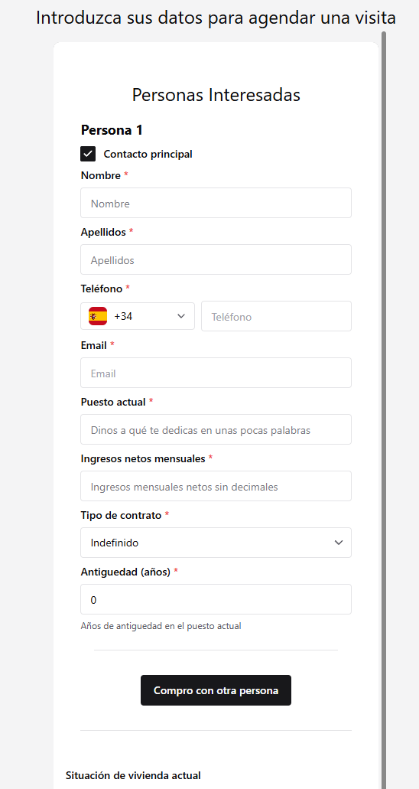

## Mejoras en la experiencia de cliente

### Nuevo formulario para los interesados

Anteriormente los interesados tenían que cumplimentar un formulario en varios pasos, lo que generaba fricción, sobretodo con la población que no está tan familiarizada con la tecnología.

Por ello, hemos simplificado significativamente el formulario para que lo puedan completar en un minuto:

### Modularización para agencias

Existen agencias que no quieren tener la funcionalidad de las auto-visitas de momento, por lo que esa funcionalidad ahora se puede activar por agencia.

#### Mejoras

- Hemos mejorado el "copy" de los mensajes tanto de la web como de comunicación inicial con los clientes, mejorando la experiencia de cliente global.
- Hemos habilitado la posibilidad de que los clientes añadan números de teléfono extranjeros
- Mejoras generales para que Estavia funcione de manera más eficiente
