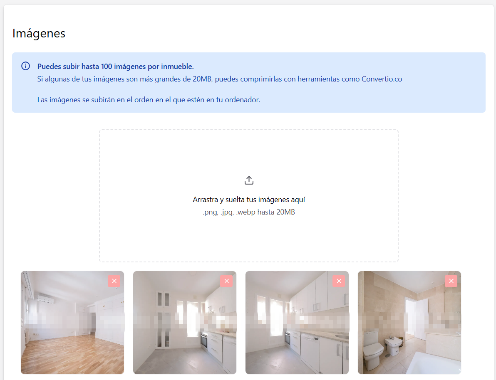
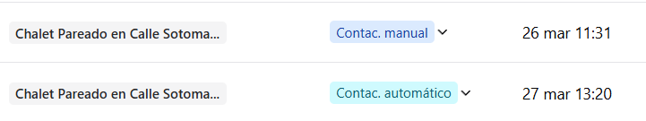

### Subir más imágenes y nuevos estados!

#### Mejoras en la subida de imágenes

Ahora se pueden subir hasta 100 imágenes, de 20MB cada una del tirón. Simplemente arrastra las imágenes de cualquier carpeta en tu ordenador a AutoVisita.

AutoVisita optimizará las imágenes una a una para ofrecer la mejor experience a tus clientes.

#### Separación del estado "contactado"

Hemos dividido el estado "Contactado" en:

- Contactado Manualmente
- Contactado Automáticamente

Para diferenciar claramente cuando un interesado ha sido contactado por AutoVisita o por un comercial:

### Mejoras

- Hemos implementado una mejora que previene la creación automática del mismo interesado por duplicado
- Hemos añadido la posibilidad de acceder a un inmueble directamente desde la tabla de interesados, haciendo click en el nombre del inmueble
